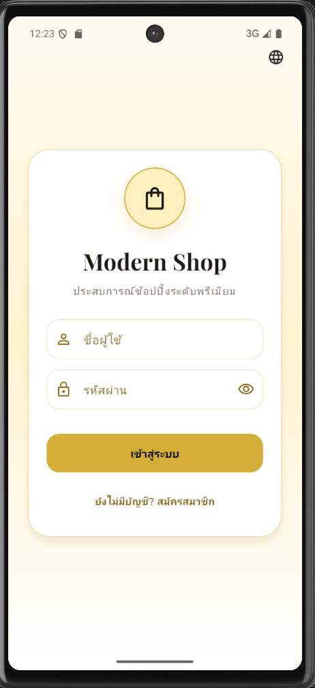
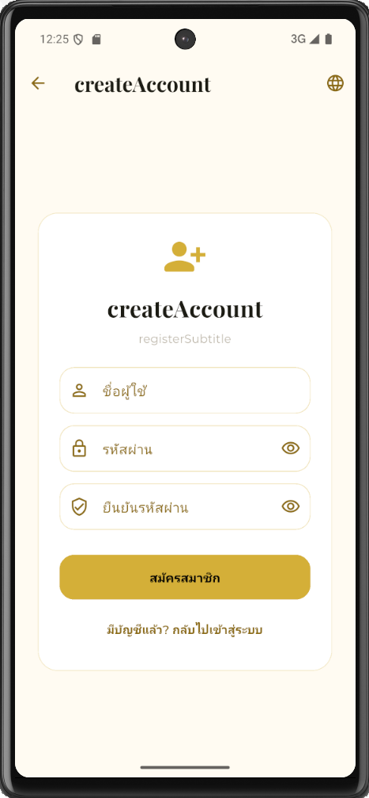
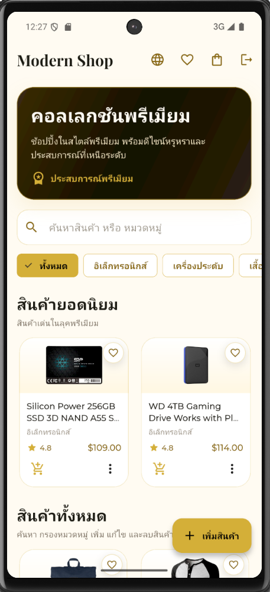
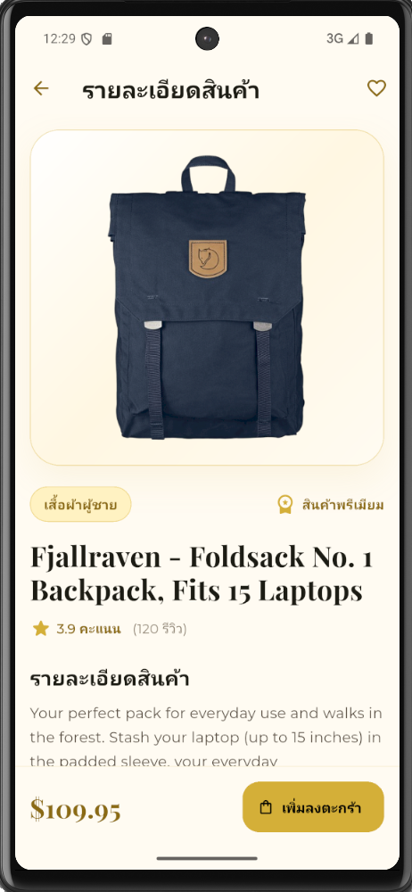
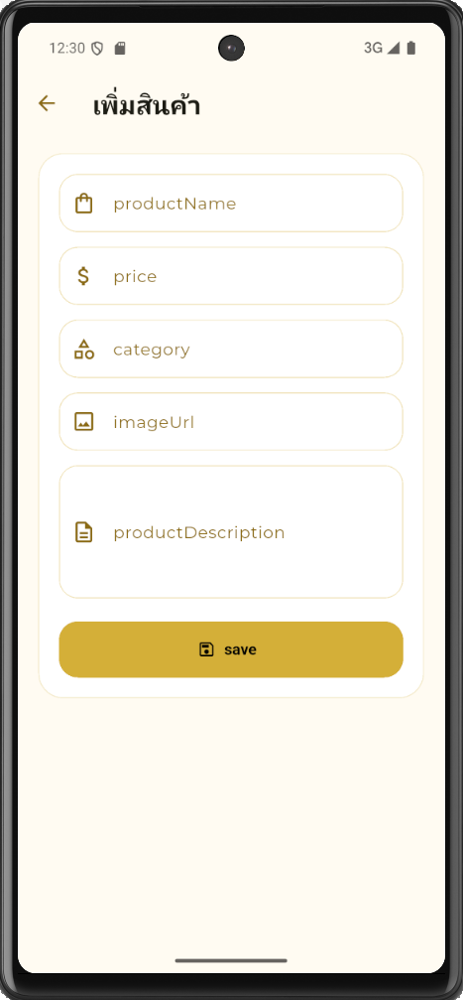
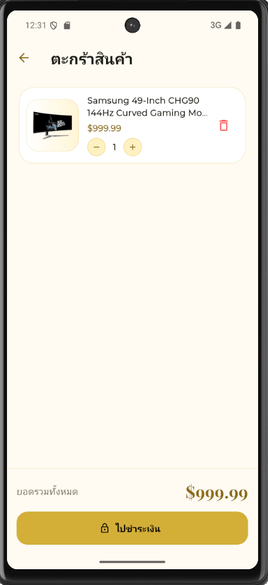
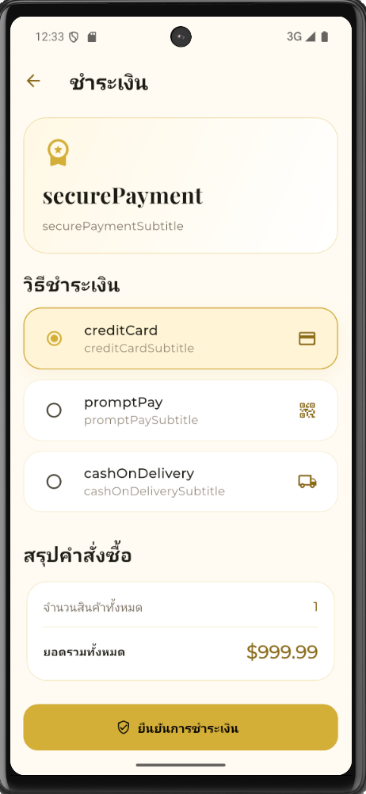
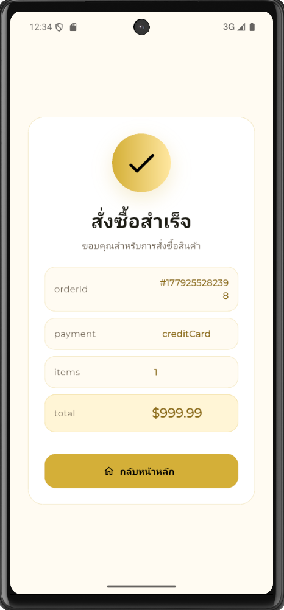

# Modern Shop - Flutter E-Commerce Application

Modern Shop เป็นแอปพลิเคชันขายสินค้าออนไลน์ที่พัฒนาด้วย Flutter โดยใช้ Provider สำหรับจัดการ State และเชื่อมต่อข้อมูลสินค้าจาก Web API ผ่าน FakeStoreAPI ตัวแอปออกแบบหน้าตาในแนว Luxury Light Theme ใช้โทนสีขาวและทอง เพื่อให้ดูทันสมัย หรูหรา อ่านง่าย และเหมาะกับแอป E-Commerce

## รายละเอียดงานคร่าว ๆ

โปรเจกต์นี้เป็น Workshop การพัฒนาแอปขายสินค้าออนไลน์ด้วย Flutter, Provider และ Web API โดยมีระบบหลักดังนี้

- ระบบสมัครสมาชิกและเข้าสู่ระบบ
- ระบบแสดงรายการสินค้าจาก Web API
- ระบบค้นหาและกรองหมวดหมู่สินค้า
- ระบบดูรายละเอียดสินค้า
- ระบบเพิ่ม แก้ไข และลบสินค้า หรือ CRUD
- ระบบตะกร้าสินค้า พร้อมเพิ่ม ลด ลบ และคำนวณยอดรวม
- ระบบสินค้าที่ชื่นชอบ หรือ Wishlist
- ระบบชำระเงินจำลอง
- ระบบเปลี่ยนภาษา ไทย / English
- ออกแบบ UI แนว Luxury Light สีขาว-ทอง

## เทคโนโลยีและ Package ที่ใช้

| รายการ | รายละเอียด |
|---|---|
| Flutter | ใช้พัฒนาแอปพลิเคชันแบบ Cross-platform |
| Dart | ภาษาโปรแกรมหลักของ Flutter |
| Provider | ใช้จัดการ State ของแอป |
| HTTP | ใช้เรียกข้อมูลจาก Web API |
| Google Fonts | ใช้ตกแต่งตัวอักษรให้สวยงาม |
| Shared Preferences | ใช้บันทึกข้อมูลภายในเครื่อง เช่น ภาษาและข้อมูลผู้ใช้ |
| FakeStoreAPI | ใช้เป็น API จำลองสำหรับดึงข้อมูลสินค้า |

## API ที่ใช้

โปรเจกต์นี้ใช้ FakeStoreAPI สำหรับดึงข้อมูลสินค้า

```text
https://fakestoreapi.com/products
```

ข้อมูลที่นำมาใช้ ได้แก่ ชื่อสินค้า ราคา รายละเอียดสินค้า หมวดหมู่สินค้า รูปภาพสินค้า และคะแนนรีวิว

## โครงสร้างโปรเจกต์

```text
lib/
├── main.dart
├── models/
│   ├── product.dart
│   └── cart_item.dart
├── services/
│   └── api_service.dart
├── providers/
│   ├── auth_provider.dart
│   ├── product_provider.dart
│   ├── cart_provider.dart
│   ├── favorite_provider.dart
│   └── language_provider.dart
├── screens/
│   ├── login_screen.dart
│   ├── register_screen.dart
│   ├── home_screen.dart
│   ├── product_detail_screen.dart
│   ├── product_form_screen.dart
│   ├── cart_screen.dart
│   ├── checkout_screen.dart
│   ├── favorite_screen.dart
│   └── order_success_screen.dart
├── widgets/
│   ├── product_card.dart
│   ├── section_title.dart
│   └── language_button.dart
└── utils/
    └── app_text.dart
```

## ภาพหน้าแอป

| หน้าแอป | ภาพตัวอย่าง |
|---|---|
| หน้า Login |  |
| หน้า Register |  |
| หน้า Home แสดงสินค้า |  |
| หน้ารายละเอียดสินค้า |  |
| หน้าเพิ่มหรือแก้ไขสินค้า |  |
| หน้าตะกร้าสินค้า |  |
| หน้า Checkout |  |
| หน้าชำระเงินสำเร็จ |  |

## คำอธิบาย Provider ที่ใช้

| Provider | หน้าที่ |
|---|---|
| AuthProvider | จัดการระบบสมัครสมาชิก เข้าสู่ระบบ และออกจากระบบ |
| ProductProvider | จัดการข้อมูลสินค้า การเรียก API และระบบ CRUD |
| CartProvider | จัดการตะกร้าสินค้า จำนวนสินค้า และยอดรวม |
| FavoriteProvider | จัดการสินค้าที่ผู้ใช้กดชื่นชอบ |
| LanguageProvider | จัดการระบบเปลี่ยนภาษาไทยและอังกฤษ |

## วิธีติดตั้งและรันโปรเจกต์

1. Clone repository

```bash
git clone https://github.com/nobpakhun01/modern_shop_app.git
```

2. เข้าไปยังโฟลเดอร์โปรเจกต์

```bash
cd modern_shop_app
```

3. ติดตั้ง Package

```bash
flutter pub get
```

4. รันแอป

```bash
flutter run
```

## สรุปผลการพัฒนา

แอป Modern Shop สามารถทำงานได้ครบตามกระบวนการพื้นฐานของแอปขายสินค้าออนไลน์ ได้แก่ สมัครสมาชิก เข้าสู่ระบบ แสดงสินค้า ค้นหาสินค้า กรองหมวดหมู่ ดูรายละเอียดสินค้า เพิ่ม แก้ไข ลบสินค้า เพิ่มสินค้าลงตะกร้า จัดการ Wishlist ชำระเงินจำลอง และเปลี่ยนภาษาไทย / อังกฤษได้ โดยใช้ Provider ในการจัดการ State และใช้ FakeStoreAPI เป็นแหล่งข้อมูลสินค้า

## ผู้จัดทำ

- GitHub: [nobpakhun01](https://github.com/nobpakhun01)
- Repository: [modern_shop_app](https://github.com/nobpakhun01/modern_shop_app)
